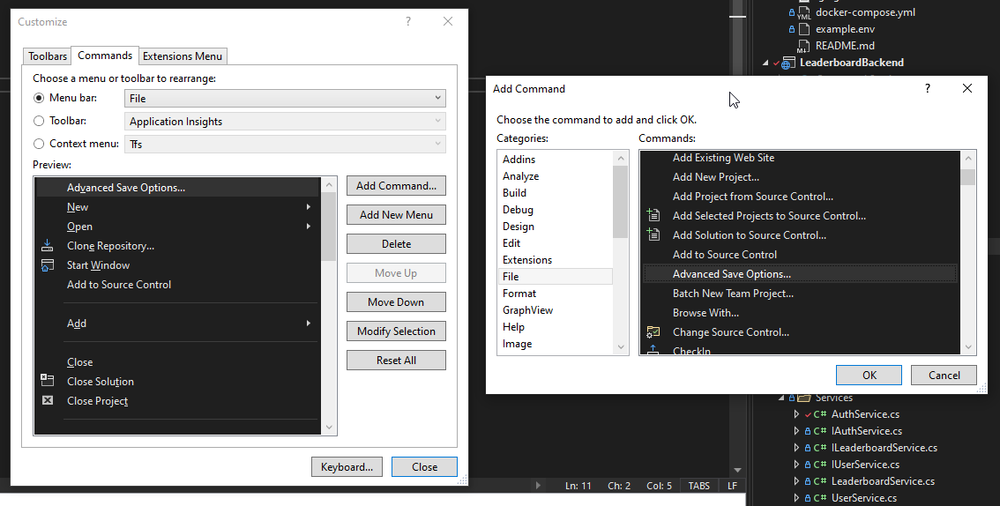

# leaderboard-backend

An open-source community-driven leaderboard backend for the upcoming leaderboards.gg. Uses ASP.NET Core.
The original backend, written in Go and inactive, can be found [here](https://github.com/leaderboardsgg/leaderboard-backend-go).

## Links
- Website: https://leaderboards.gg
- Other Repos: https://github.com/leaderboardsgg
- Discord: https://discord.gg/TZvfau25Vb

## Tech-Stack Information

* JSON REST API intended for the leaderboards.gg site
* C# with ASP.NET Core, .NET 7
* Docker containers for PostgreSQL hosting and management run via [Docker Compose](https://docs.docker.com/compose/install/), and also for integration tests with [Testcontainers](https://dotnet.testcontainers.org/)

# Project Setup

## Editor/IDE

There are a couple options available for you to choose, depending on your OS.

### Visual Studio (for Windows)

If you are on Windows/are a beginner, this will likely be the easiest to use.

* Download [Visual Studio 2022](https://visualstudio.microsoft.com/vs/) (Community edition is free) or modify your existing install
  * You must choose this version as we use the .NET 7 SDK which older versions do not support
* In the section where you choose your Workloads, select at least "ASP.NET and Web Development"

Once VS has set itself up, you'll have to explicitly tell it to _not_ override our .editorconfig settings*. Go to Tools -> Customise -> Commands, pick "File" in the "Menu bar" item, then in the Add Command window, choose File -> Advanced Save Options, and finally, set that to "Current Setting". Screenshot below for a little extra clarity:



> \* VS saves files with `CRLF`, which isn't good for everyone else on Mac/Linux. We've already set explicit line endings in our .editorconfig, but VS overrides it by default.

That should be it! Any other requirements to set up and run the application should be a directed process through the IDE.

### Visual Studio Code/Other Editors

A few cross-platform editor choices would be:

* [Monodevelop (IDE)](https://www.monodevelop.com)
* [Visual Studio Code (Code Editor)](https://code.visualstudio.com/Download)
* Other editors with [Omnisharp integrations](http://www.omnisharp.net/#integrations)

After installing a code editor:

* Install support for [`editorconfig` in your editor](https://editorconfig.org/#download)
* Download the [.NET 7 SDK](https://dotnet.microsoft.com/en-us/download/dotnet/7.0) for your platform
    > Try to avoid [installing via snap](https://docs.microsoft.com/en-us/dotnet/core/install/linux-snap); trying to get dotnet running was more pain than it's worth.
* After cloning this repo, run the command `dotnet restore` to install all required dependencies
* You will likely want to set up [Omnisharp](http://www.omnisharp.net/) for easier development with your editor
	* In Visual Studio Code, you can simply install the [C# extenstion](https://github.com/OmniSharp/omnisharp-vscode) (use this link or the editor UI)
	* Other editors will need to follow instructions to install the Language Server on their system manually

## Running the Application

The application reads configuration from environment variables, a `.env` file, and a `appsettings.json` file.

The easiest is to make a `.env` file. As a starting point, you can copy the template file `example.env` at the project root and rename it to `.env`.
```bash
cp example.env .env
```

### Running the Database(s)

#### Postgres with Docker compose
As mentioned above, we run Docker containers for the DB. After [installing Docker Compose](https://docs.docker.com/compose/install/), run this command in the project root:

```bash
docker compose up -d
```
If you're using Linux, you might need to run Docker with `sudo`.

This starts up:
- Adminer which is a GUI manager for the databases
- A Postgres DB

If you're using the default values provided in `example.env`, input these values in Adminer for access:

| Field    | Value              | Comment
| -------- | ------------------ | -------
| System   | PostgreSQL         |
| Server   | `db`               | You cannot set it to `localhost` because it must match the Docker container name
| Username | `admin`            | Corresponds to the `ApplicationContext__PG__USER` config
| Password | `example`          | Corresponds to `ApplicationContext__PG__PASSWORD`
| Database | `leaderboardsmain` | Corresponds to `ApplicationContext__PG__DB`

### Visual Studio

#### First Time Setup

After opening the solution, right click the `LeaderboardBackend` project and click "Set as Startup Project".

#### Run the App

Press F5 or the green play button at the top of the IDE.
Note: The first time running the app, the IDE will prompt you to trust the HTTPS development certs.

#### Test the App

After expanding the `LeaderboardBackend.Test` project, you should be able to select `Test > Run All Tests` from the top of the top menu. Alternatively, you can use the Test Explorer by selecting `Test > Test Explorer`.

### `dotnet` CLI

#### First Time Setup

You will need to trust the HTTPS development certs.
On Windows/Mac, you can run the following command (from the [.NET docs](https://docs.microsoft.com/en-us/dotnet/core/additional-tools/self-signed-certificates-guide#create-a-self-signed-certificate)):

```bash
dotnet dev-certs https --trust
```

If you are on Linux, you will need to follow your distribution's documentation to trust a certificate.

* [This chapter](https://docs.microsoft.com/en-us/aspnet/core/security/enforcing-ssl?view=aspnetcore-6.0&tabs=visual-studio#trust-https-certificate-on-linux) in the .NET docs covers how to generate and then trust the dev cert for service-to-service (e.g. cURLing) and browser communications on Ubuntu.
  * Trusting certs on Fedora and other distros(??) are linked at the bottom of the chapter.

You can read [this chapter](https://docs.microsoft.com/en-us/dotnet/core/additional-tools/self-signed-certificates-guide#clean-up) if you'd like to clear all certs and start over.

Then run the following commands to run the DB migrations:

```bash
# Install project tools
dotnet tool restore
# Run migrations
cd LeaderboardBackend
dotnet ef database update
```

#### Run the App

To run the application from the CLI, run the following command from the root of the repository:

```bash
cd LeaderboardBackend
dotnet run  # or `dotnet watch` to run with hot reload
```

#### Test the App
Docker is required to run integration tests against a real Postgres database.  
To run the tests, run the following commands from the root of the repository:

```bash
cd LeaderboardBackend.Test
dotnet test
```

Tests may error [due to failure of the Docker container to be found](https://github.com/testcontainers/testcontainers-dotnet/issues/921). To fix, set `TESTCONTAINERS_DOCKER_SOCKET_OVERRIDE=/var/run/docker.sock`.

To debug with breakpoints, first call `export VSTEST_DEBUG=1` before running a test. Doing this allows you to attach a debug process to hit breakpoints with.
